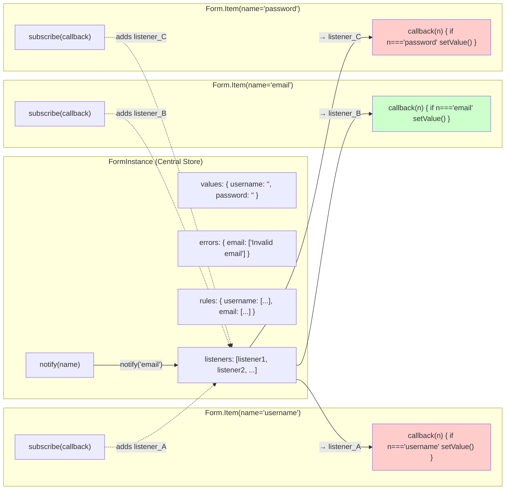
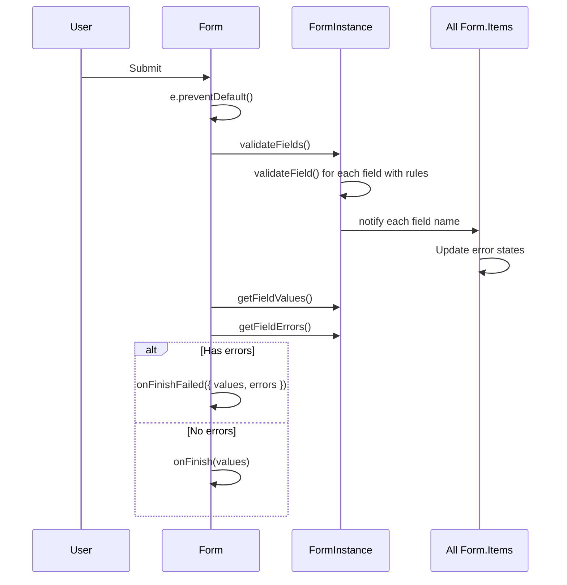
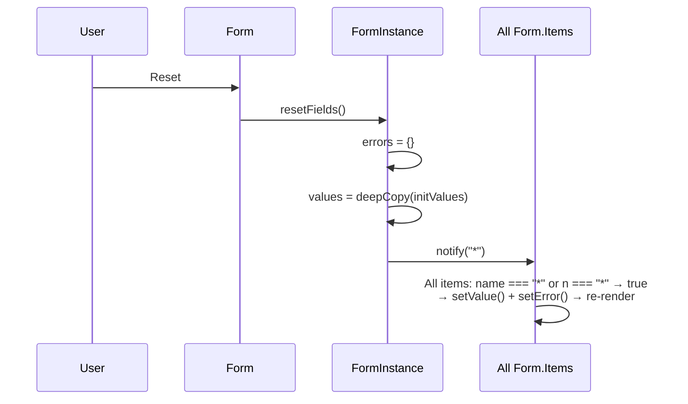
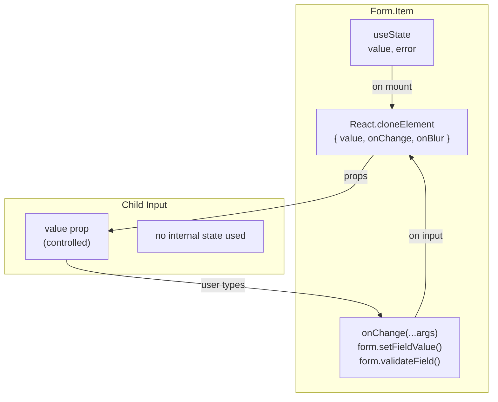
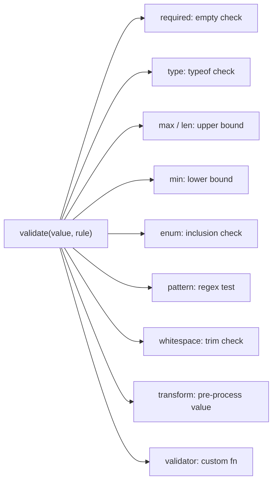

# Form Component Architecture

## Overview

The Form system uses a **pub/sub pattern** built around a central `FormInstance` class, with two React Contexts wiring everything together.

```
Form (Provider)
 ├── FormInstanceContext  →  shares the FormInstance (state store)
 ├── FormOptionsContext   →  shares layout/validation options
 └── Form.Item (Consumer) →  subscribes to FormInstance for its field
```

### FormInstance — The State Store

A plain class (not React state) that holds all form data:

| Concern | Storage | Key Methods |
|---|---|---|
| **Values** | `values: { [name]: any }` | `getFieldValue`, `setFieldValue`, `setFieldValues` |
| **Errors** | `errors: { [name]: string[] }` | `getFieldError`, `setFieldError` |
| **Rules** | `rules: { [name]: Rule[] }` | `setFieldRules` |
| **Subscriptions** | `listeners: ((name) => void)[]` | `subscribe`, `notify` |

When a value or validation result changes, `notify(name)` fires and every subscribed `FormItem` checks if the notification is relevant to it.

### Form — The Wrapper

- Creates (or accepts via `form` prop) a `FormInstance`, stored in a `useRef`
- Provides it to children via `FormInstanceContext`
- Provides layout options (`labelCol`, `wrapperCol`, `validateTrigger`, `layout`) via `FormOptionsContext`
- Handles **submit**: calls `validateFields()` on all fields, then routes to `onFinish` or `onFinishFailed`
- Handles **reset**: calls `resetFields()` which resets values to `initialValues` and notifies all fields with `'*'`

### Form.Item — The Field Connector

Each `Form.Item` with a `name` prop:

1. **Registers rules** — On mount, calls `form.setFieldRules(name, rules)`
2. **Subscribes** — Calls `form.subscribe(callback)` in a `useEffect`. Updates local `value`/`error` state only if the notification matches its own `name` (or either side uses `'*'`)
3. **Injects props via `cloneElement`** — The child component gets:
   - `value` (or the prop name from `valuePropName`) — bound to `form.getFieldValue(name)`
   - `onChange` — calls `form.setFieldValue()` and optionally validates (if `validateTrigger === 'onChange'`)
   - `onBlur` — validates on blur (if `validateTrigger === 'onBlur'`)
4. **Renders layout** — Uses `Row`/`Col` grid for label and input columns
5. **Shows errors** — Displays validation errors with a slide-down `<Transition>` animation

### useForm Hook

A factory function that creates a `FormInstance` externally:

```ts
const [form] = Form.useForm({ username: '', password: '' });
// Pass to <Form form={form}> to control the form programmatically
```

If no `form` prop is provided, `Form` creates one internally.

### Validation (form-helper.ts)

The `validate` function checks a value against a `Rule` supporting: `required`, `type`, `max`, `min`, `len`, `enum`, `pattern`, `whitespace`, `transform`, and custom `validator` functions.

---

## Diagrams

### Component Hierarchy & Context Flow

```mermaid
graph TD
    subgraph Form["<Form> Provider"]
        FI["FormInstance (useRef)"]
        FIC["FormInstanceContext.Provider"]
        FOC["FormOptionsContext.Provider"]
    end

    subgraph FormItem1["Form.Item (name='username')"]
        CE1["cloneElement → {value, onChange, onBlur}"]
    end

    subgraph FormItem2["Form.Item (name='password')"]
        CE2["cloneElement → {value, onChange, onBlur}"]
    end

    subgraph Input1["Input (controlled by value prop)"]
        V1["value: from useState"]
    end

    subgraph Input2["Input (controlled by value prop)"]
        V2["value: from useState"]
    end

    FI --> FIC
    FI --> FOC
    FIC --> FormItem1
    FIC --> FormItem2
    FOC --> FormItem1
    FOC --> FormItem2

    FormItem1 --> CE1 --> V1
    FormItem2 --> CE2 --> V2
```



### Subscribe/Notify Pattern (Pub/Sub)



### Data Flow: User Input → UI Update (Controlled)

```mermaid
sequenceDiagram
    participant User
    participant Input as <Input />
    participant Item as Form.Item
    participant Store as FormInstance
    participant Item2 as Form.Item (other)

    Note over Item: Mount: subscribe(listener) + setFieldRules(name, rules)

    User->>Input: Types "a"
    Input->>Item: onChange("a")
    Item->>Store: setFieldValue("field", "a")
    Store->>Store: values["field"] = "a"
    Store->>Store: notify("field")
    Store->>Item: listener("field") fires
    Store->>Item2: listener("field") fires

    Note over Item2: n === "field" but name !== "field"<br/>→ ignore, no update

    Item->>Item: setValue("a") → re-render
    Item->>Input: cloneElement injects new value="a"

    Note over Input: Controlled: displays "a"

    alt validateTrigger === "onChange"
        Item->>Store: validateField("field")
        Store->>Store: run validate() on rules
        Store->>Store: setFieldError + notify("field")
        Store->>Item: listener fires again
        Item->>Item: setError() → show/hide error
    end
```



### Data Flow: Form Submit



### Data Flow: Form Reset



### Controlled Component Pattern



### Validation Rules


